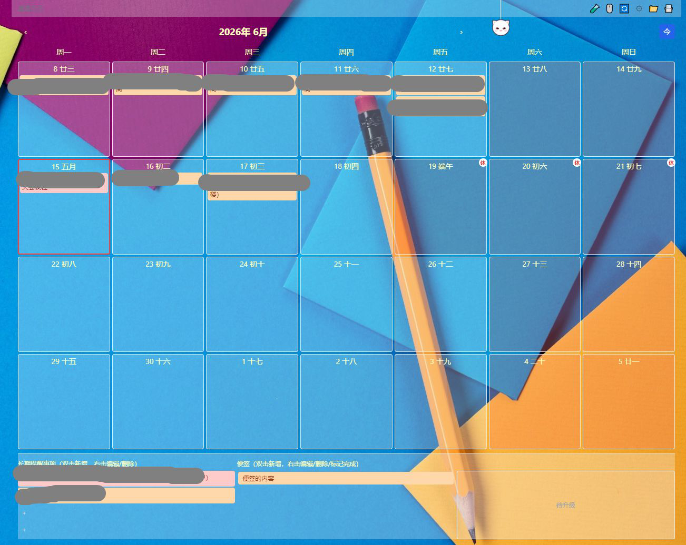
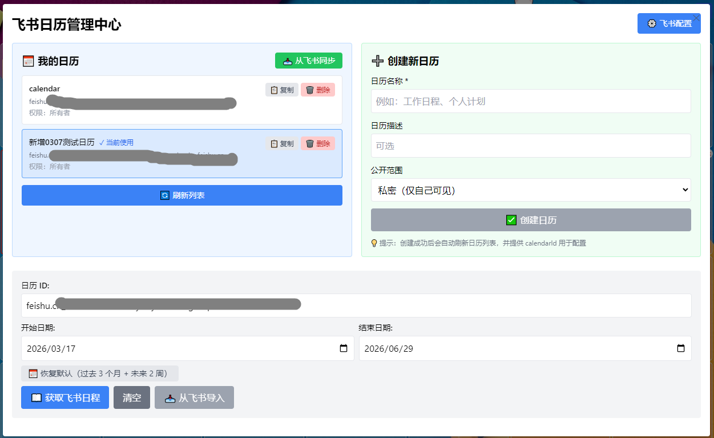
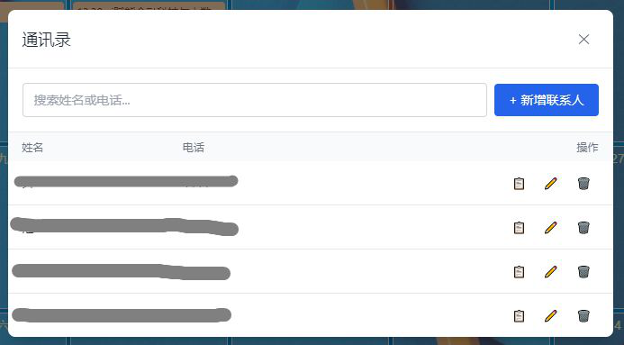
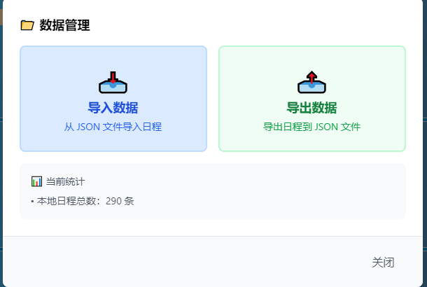

# 桌面日历 - Desktop Calendar

一款基于 Electron 的桌面日历应用，支持日程管理、飞书日历同步、日历管理和中国法定节假日显示。

## 📖 项目背景

### 为什么开发这个工具？

我一直是 **Desktop Calendar** 的忠实用户，这款简洁的桌面日历工具基本满足了我的日常需求。但在大模型时代，我有了新的痛点：

- 📝 **工作记录分散**：日常工作、会议、文档散落在不同平台
- 🤖 **大模型理解困难**：AI 助手难以理解我的工作重点和材料文稿的关联性
- 🔗 **缺乏关联整合**：需要将日历、文档、会议等信息关联起来

### 项目愿景

我希望打造一个能够**关联工作上下文**的智能日历工具：

- ✅ 关联飞书文档 - 让 AI 理解工作内容
- ✅ 关联会议日程 - 追踪工作重点和时间分配
- ✅ 关联个人笔记 - 记录思考和进展
- ✅ 阶段性导出 - 为 AI 提供结构化的工作上下文

### 开发现状

目前项目处于**稳定开发阶段**：

- ✅ 基础日历功能完善
- ✅ 飞书日历双向同步
- ✅ 中国法定节假日显示
- ✅ 农历日期和传统节日显示
- ✅ 智能月份导航（按4周步长翻页，避免漏周）
- ✅ 日程导出功能（JSON 格式）
- ✅ 优先级管理（高/中/低）
- ✅ 优化日历显示空间利用率
- ✅ 4周日历显示（更紧凑布局）
- ✅ 长期提醒事项功能（独立区域，不与飞书同步）
- ✅ 便签功能（快速记录待办，支持标记完成）
- ✅ 通讯录功能（快速管理联系人信息）
- ✅ 节假日和调休标记醒目显示
- ✅ 日历管理功能（查看、创建、删除日历）
- ✅ 标题去重（同一天内标题不允许重复）
- ✅ 同步防重复（队列去重 + 合并窗口，避免重复创建）
- ✅ 定时同步（每天指定时间自动同步，支持手动触发）

### 关于开发者

👋 我不是专业程序员，这个项目是使用 **Trae**（AI 编程助手）从零开始开发的。

如果你：
- 💡 有类似的需求和想法
- 🛠️ 愿意一起改进这个工具
- 🤝 希望为开源项目贡献代码

欢迎加入！让我们一起打造更好用的工作台历工具。

### 特别感谢

- 🙏 **ShuYZ** - 提供 [中国节假日数据 JSON 文件](https://www.shuyz.com/githubfiles/china-holiday-calender/master/holidayAPI.json)
- 🙏 **Trae** - AI 编程助手，让非程序员也能开发应用
- 🙏 **开源社区** - 所有提供灵感和帮助的项目

---

## 📸 应用截图

### 主界面 - 日历与底部面板



> 日历主体显示 4 周×7 天布局，底部包含长期提醒事项、便签和待升级区域

### 飞书日历管理中心



> 管理飞书日历列表、创建新日历、配置同步参数

### 通讯录功能



> 快速管理联系人信息，支持搜索和一键复制电话

### 数据管理



> 支持日程数据的导入导出，JSON 格式便于大模型分析

---

## ✨ 功能特性

### 📅 日历基础功能
- **桌面常驻显示**：日历窗口常驻桌面，壁纸上层、其他应用下层，像壁纸一样显示
- **防最小化机制**：点击"显示桌面"后，窗口失去焦点时自动保持在底层
- **日程管理**：支持日程的增删改查，双击日期快速添加
- **标题去重**：同一天内日程标题不允许重复，表单内实时提示（标题框变红 + 错误提示）
- **同步防重复**：队列去重 + 合并窗口（5秒），同一日程多次修改只保留最新版本
- **农历显示**：在公历日期旁显示农历日期和传统节日
- **月份导航**：支持上个月/下个月/今天快速切换，按4周（28天）步长翻页，避免漏周
- **窗口透明度调节**：0-100% 可调，仅影响背景色，文字保持清晰
- **鼠标穿透功能**：开启后鼠标可以穿透日历窗口操作桌面
- **窗口位置记忆**：自动保存和恢复窗口位置、大小
- **自定义颜色**：可设置工作日、周末、其他月的背景色
- **优先级管理**：支持高/中/低优先级设置
- **4周日历显示**：日历主体显示4周×7天，布局更紧凑
- **节假日醒目显示**：节假日显示"休"字，调休日显示"班"字
- **周末背景优先**：跨月周末优先显示周末背景色

### 🔄 飞书日历同步
- **持久化配置**：配置保存到用户数据目录，一次配置永久使用
- **首次启动引导**：首次启动自动弹出配置向导，引导用户配置飞书凭证
- **双向同步**：本地日程与飞书日历双向同步
- **增量同步**：使用 sync_token 实现增量同步，提高效率
- **定时同步**：每天指定时间自动同步（默认 12:00），可在设置中自定义
- **手动同步**：点击顶部同步按钮立即处理队列
- **队列合并**：同一日程多次修改只保留最新版本，避免重复同步
- **冲突解决**：基于最后同步时间的冲突解决机制
- **防重复创建**：队列去重 + 合并窗口（5秒），确保同一日程只同步一次

### 🗓️ 日历管理
- **查看日历列表**：显示账号下所有可访问的日历
- **创建新日历**：支持创建共享日历，设置名称、描述、公开范围
- **删除日历**：双重确认防误删机制
- **切换日历**：快速切换当前使用的日历
- **复制日历 ID**：一键复制日历 ID 用于配置

### 📌 长期提醒事项
- **独立区域显示**：位于日历底部，与日历日期区分明确
- **三栏布局**：长期提醒事项（33%）| 便签（33%）| 待升级（33%）
- **双击新增/编辑**：双击空白区域新增事项，双击已有事项编辑
- **右击菜单**：右击事项弹出编辑/删除菜单，界面更简洁
- **重要性颜色区分**：高优先级显示红色，中优先级显示橙色，低优先级显示灰色
- **数据存储**：使用本地 localStorage，不与飞书日历同步
- **容量限制**：最多支持 4 个长期提醒事项

### 📝 便签功能
- **快速记录**：双击便签区域空白处即可新增便签
- **重要程度**：支持高/中/低三种重要程度，颜色区分
- **标记完成**：右键便签可选择"标记完成"，完成后不再显示
- **导出集成**：导出日程时，完成时间在导出时段内的便签一并导出
- **数据存储**：使用本地 localStorage，不与飞书日历同步

### 📇 通讯录功能
- **入口按钮**：位于顶部导航栏（📇图标），在导入/导出按钮旁
- **联系人管理**：支持新增、编辑、删除联系人
- **搜索功能**：支持按姓名或电话快速搜索
- **复制电话**：一键复制电话号码到剪贴板
- **数据存储**：使用本地 localStorage 存储

### 🏮 节假日功能
- **中国法定节假日**：自动显示国家法定节假日
- **调休工作日**：清晰标记需要补班的调休日
- **数据更新**：每年手动更新一次节假日数据
- **醒目显示**：节假日显示"休"字，调休日显示"班"字

## 🛠️ 技术栈

- **框架**：Electron 28 + React 18 + TypeScript
- **构建工具**：Vite 5 + electron-vite
- **UI 库**：Tailwind CSS
- **API 集成**：飞书开放平台 Calendar API v4

## 📦 安装

### 环境要求
- Node.js >= 18.x
- Windows 10/11

### 安装步骤

1. **克隆项目**
```bash
git clone <repository-url>
cd calendar-feishu
```

2. **安装依赖**
```bash
npm install
```

3. **配置飞书应用**（如需要飞书同步功能）

   **首次启动配置**：
   - 启动应用后，会自动弹出配置向导
   - 填写飞书应用的 App ID、App Secret 和 Calendar ID
   - 配置会自动保存到用户数据目录
   - 下次启动时无需重新配置

   **开发环境配置**：
   - 复制 `src/main/feishuConfig.example.ts` 为 `src/main/feishuConfig.ts`
   - 填写你的飞书应用 App ID 和 App Secret
   - 填写你的日历 ID
   - ⚠️ 注意：`feishuConfig.ts` 仅用于开发环境，release 中不会包含此文件

4. **启动应用**

   **方式 1：隐藏终端启动（推荐）**
   ```bash
   # Windows - 双击 start-dev.vbs 文件
   # 终端不会显示在任务栏，避免误关闭
   ```
   
   **方式 2：VS Code 任务启动（开发推荐）**
   ```bash
   # 在 VS Code 中按 Ctrl+Shift+P
   # 输入 "Tasks: Run Task"
   # 选择 "npm: dev"
   ```
   
   **方式 3：传统终端启动**
   ```bash
   npm run dev
   ```

5. **构建发布**
```bash
npm run build
```

## 🚀 使用说明

### 📝 基本操作

#### 添加日程
1. 双击日历上的任意日期
2. 填写日程信息（标题、时间、地点、优先级等）
3. 点击"保存"按钮

#### 编辑日程
1. 右键点击已有日程
2. 选择"编辑"
3. 修改信息后保存

#### 删除日程
1. 右键点击日程
2. 选择"删除"
3. 确认删除

#### 月份导航
- **上个月**：点击 ‹ 按钮，按4周步长向前翻页
- **下个月**：点击 › 按钮，按4周步长向后翻页
- **回到今天**：点击 "今" 按钮，快速回到当前月份
- **显示规则**：今天所在的周始终显示在第 2 行，上方显示 1 周，下方显示 3 周

#### 农历显示
- 每个日历日期旁显示对应的农历日期
- 传统节日显示特殊标记（如春节、端午、中秋等）
- 农历字体与公历保持一致，可统一设置颜色、大小、字体

### ⚙️ 设置功能

点击标题栏的 ⚙️ 按钮打开设置：

#### 背景透明度
- 拖动滑块调节透明度（0-100%）
- 仅影响背景色，文字保持清晰
- 点击"保存"立即生效

#### 窗口大小
- 可调节窗口宽度和高度
- 窗口位置会自动保存
- 重启应用后恢复上次的位置

#### 颜色主题
- **工作日背景**：默认浅蓝色 (#eff6ff)
- **周末背景**：默认浅红色 (#fef2f2)
- **其他月背景**：默认浅灰色 (#f3f4f6)

#### 鼠标穿透
- 点击 🖱️ 按钮开启/关闭
- 开启后鼠标可以穿透日历窗口
- 再次点击按钮或点击桌面关闭

### 🗓️ 飞书日历管理

点击标题栏的 🧪 按钮打开"飞书日历管理中心"：

#### 查看日历列表
1. 打开飞书日历管理中心
2. 点击"🔄 刷新列表"加载日历
3. 显示所有可访问的日历（名称、ID、权限）

#### 创建新日历
1. 在右侧"创建新日历"区域
2. 填写日历名称（必填）
3. 可选填写描述、选择公开范围
4. 点击"✅ 创建日历"
5. 创建成功后自动刷新列表

#### 删除日历
1. 找到要删除的日历
2. 点击右侧的"🗑️ 删除"按钮
3. **第一次确认**：确认删除操作
4. **第二次确认**：再次确认
5. 删除成功后列表自动刷新

⚠️ **注意**：删除日历会同时删除该日历下的所有日程，请谨慎操作！

#### 切换日历
1. 点击日历列表中的任意日历
2. 该日历会被选中并标记为"当前使用"
3. 下方的日历 ID 输入框会自动更新

#### 复制日历 ID
1. 点击日历右侧的"📋 复制"按钮
2. 日历 ID 已复制到剪贴板
3. 可用于配置文件或分享

### 🔄 飞书日历同步

#### 首次配置（推荐方式）
1. 启动应用后，会自动弹出配置向导
2. 访问 [飞书开放平台](https://open.feishu.cn/) 创建企业自建应用
3. 添加日历权限，获取 App ID 和 App Secret
4. 访问 [飞书日历管理平台](https://feishu.cn/calendar_console) 创建或选择日历
5. 复制日历 ID（格式：feishu.cn_xxx@group.calendar.feishu.cn）
6. 将配置填入配置向导
7. 配置会自动保存，下次启动无需重新配置

#### 开发环境配置
1. 复制 `src/main/feishuConfig.example.ts` 为 `src/main/feishuConfig.ts`
2. 填写你的飞书应用 App ID 和 App Secret
3. 填写你的日历 ID
4. ⚠️ **注意**：`feishuConfig.ts` 仅用于开发环境，不会打包到 release 中

#### 配置管理
- **查看配置**：点击标题栏的 ⚙️ 按钮，在设置中可以查看当前配置状态
- **修改配置**：在飞书日历管理中心页面点击 "⚙️ 飞书配置" 按钮
- **配置存储位置**：`%APPDATA%/calendar-feishu/feishu-user-config.json`
- **安全说明**：配置文件不会打包到 release 中，避免信息泄露

#### 同步操作
1. **手动同步**：点击标题栏的 🔄 同步按钮，立即处理队列中的待同步日程
2. **定时同步**：每天到达设定时间（默认 12:00）自动同步，可在设置中自定义
3. 等待同步完成，本地日程和飞书日历将保持一致

#### 定时同步设置
1. 点击 ⚙️ 设置按钮，切换到"窗口"标签页
2. 找到"定时同步设置"区域
3. 选择每天自动同步的小时和分钟
4. 点击"保存"生效
5. 应用会在每天指定时间自动将本地日程同步到飞书

### 📤 日程导出

#### 导出操作
1. 点击标题栏的 📤 导出按钮
2. 选择导出日期范围（开始日期和结束日期）
3. 选择保存位置
4. 导出为 JSON 格式，包含日程统计信息

#### 导出内容
- 导出范围内的所有日程
- 按优先级分类统计
- 按月份分类统计
- 适用于大模型分析撰写总结

### 🏮 节假日显示

#### 自动显示
- 应用启动时自动加载节假日数据
- 法定节假日显示红色"休"字标记
- 调休工作日显示绿色"班"字标记

#### 更新节假日数据
1. 下载最新的 `holidayAPI.json`
2. 替换 `src/renderer/public/holidayAPI.json`
3. 重启应用

## 📁 项目结构

```
calendar-feishu/
├── src/
│   ├── main/                    # 主进程代码
│   │   ├── index.ts            # 主进程入口
│   │   ├── feishuAuth.ts       # 飞书认证模块
│   │   ├── feishuCalendar.ts   # 飞书日历 API
│   │   ├── feishuConfig.ts     # 飞书配置
│   │   └── feishuConfig.example.ts
│   ├── preload/                 # 预加载脚本
│   │   └── index.ts
│   └── renderer/                # 渲染进程（React）
│       ├── public/
│       │   └── holidayAPI.json  # 节假日数据
│       └── src/
│           ├── sync/            # 同步模块
│           │   ├── SyncManager.ts
│           │   ├── syncQueue.ts
│           │   └── syncUtils.ts
│           ├── types/           # 类型定义
│           │   └── holiday.ts
│           ├── utils/           # 工具函数
│           │   ├── colorUtils.ts
│           │   ├── exportUtils.ts      # 导出工具
│           │   ├── holidayManager.ts
│           │   └── lunarUtils.ts       # 农历转换工具
│           ├── App.tsx          # 主组件
│           ├── EventFormModal.tsx      # 日程表单
│           ├── ExportModal.tsx         # 导出功能
│           ├── FeishuTestPage.tsx      # 飞书日历管理
│           ├── SettingsModal.tsx       # 设置弹窗
│           ├── LongTermRemindersPanel.tsx  # 长期提醒事项
│           ├── LongTermReminderForm.tsx    # 长期提醒表单
│           ├── ContactsModal.tsx         # 通讯录
│           └── types.ts
├── .trae/                       # 本地开发文档（不推送到仓库）
│   └── documents/               # 项目文档
├── resources/                   # 应用资源
├── electron-builder.json        # Electron 构建配置
├── electron.vite.config.ts      # Vite 配置
├── package.json
├── tsconfig.json
└── README.md
```

## 🔧 配置文件

### feishuConfig.ts

```typescript
export const FEISHU_CONFIG = {
  appId: 'YOUR_APP_ID',           // 飞书应用 App ID
  appSecret: 'YOUR_APP_SECRET',   // 飞书应用 App Secret
  apiBaseUrl: 'https://open.feishu.cn/open-apis',
  timeout: 10000,
  calendarId: 'YOUR_CALENDAR_ID'  // 同步日历 ID
}
```

## ❓ 常见问题

### Q: 飞书同步失败怎么办？
A: 
1. 检查网络连接
2. 确认 App ID 和 App Secret 配置正确
3. 确认应用已添加日历权限
4. 确认日历 ID 正确且有编辑权限

### Q: 窗口位置不保存怎么办？
A: 
1. 检查是否有写入权限
2. 查看配置文件是否可写
3. 重启应用后再试

### Q: 节假日数据如何更新？
A: 
1. 从 GitHub 下载最新的 `holidayAPI.json`
2. 替换 `src/renderer/public/holidayAPI.json`
3. 重启应用

### Q: 如何关闭应用？
A: 
- 通过系统托盘图标右键选择退出
- 或使用任务管理器

### Q: 透明度设置无效？
A: 
- 确保点击了"保存"按钮
- 透明度仅影响背景色，文字保持清晰

### Q: 农历显示不准确？
A:
- 农历转换使用 `lunar-calendar` 库自动计算
- 传统节日（春节、端午等）自动识别显示
- 可在设置中统一调整日历字体颜色、大小、字体

### Q: 导出的 JSON 文件有什么用？
A:
- 导出的 JSON 包含指定日期范围内的所有日程
- 包含按优先级和月份的统计信息
- 可用于大模型分析，生成工作总结、时间分配分析等

### Q: 日历列表显示 0 个日历？
A:
1. 检查飞书应用是否已发布
2. 确认添加了日历读取权限
3. 查看控制台日志获取详细错误信息
4. 确认当前租户下已创建日历

### Q: 删除日历时有什么注意事项？
A:
- ⚠️ **删除操作不可恢复**
- 会同时删除该日历下的所有日程
- 需要双重确认才能删除
- 请确保输入正确的日历名称

### Q: 周末背景颜色显示不对？
A:
- 日历显示4周（28天）后，跨月的周末可能同时满足"非当月"和"周末"条件
- 程序已优化判断优先级：**周末优先于非当月**
- 如果仍有问题，请检查设置中的周末背景色配置

### Q: 翻页时漏掉一周怎么办？
A:
- 翻页步长已改为按4周（28天），与显示范围一致
- 每次翻页刚好衔接，不会漏掉任何一周
- 如果仍有问题，请点击"今天"按钮回到当前日期

### Q: 日程标题重复怎么办？
A:
- 同一天内日程标题不允许重复
- 添加/编辑日程时，表单会自动检测标题重复
- 重复时标题框变红并显示错误提示
- 修改标题后错误自动消失，可以重新保存

### Q: 新建日程同步到飞书后变成两条怎么办？
A:
- 程序已修复同步重复问题
- 采用队列去重 + 合并窗口（5秒）机制
- 同一日程多次修改只保留最新版本，确保只同步一次
- 新建日程加入队列后不会立即同步，等待手动或定时同步

### Q: 定时同步如何设置？
A:
- 点击 ⚙️ 设置按钮，切换到"窗口"标签页
- 找到"定时同步设置"区域
- 选择每天自动同步的小时和分钟（默认 12:00）
- 点击"保存"生效
- 也可以随时点击顶部 🔄 按钮手动同步

### Q: 长期提醒事项如何添加？
A:
- 双击长期提醒事项区域的空白格子即可新增
- 双击已有事项可以编辑
- 右击事项可以选择编辑或删除
- 最多支持 4 个事项

### Q: 便签功能如何使用？
A:
- 双击便签区域空白处即可新增便签
- 填写标题和选择重要程度后保存
- 右键便签可选择编辑、删除或标记完成
- 标记完成的便签不再显示
- 导出日程时，完成时间在导出时段内的便签会一并导出

### Q: 如何添加通讯录联系人？
A:
- 点击顶部导航栏的 📇 按钮打开通讯录
- 点击"+ 新增联系人"按钮
- 填写姓名和电话后保存
- 支持搜索和复制电话功能

##  版本历史

### v1.7 (当前版本)
- 🔄 **同步机制重构**
  - 移除实时自动同步，改为纯定时/手动同步
  - 队列去重：同一日程同一操作直接替换，不重复入队
  - 合并窗口扩大到 5 秒，跨操作合并更智能
  - 手动同步按钮现在会实际处理队列
- ⏰ **定时同步功能**
  - 每天指定时间自动同步（默认 12:00）
  - 设置页面新增"定时同步设置"区域
  - 支持自定义小时和分钟
  - 每天只同步一次，避免重复
- 🐛 **修复同步重复问题**
  - 新建日程不再立即同步到飞书
  - 同一日程多次修改只保留最新版本
  - 确保飞书日历中同一日程只出现一次

### v1.6
- 📝 **新增便签功能**
  - 位于长期提醒事项右侧，三栏布局（33% | 33% | 33%）
  - 支持标题、重要程度（高/中/低）、添加时间、完成时间
  - 双击空白区域新增，右键编辑/删除/标记完成
  - 标记完成的便签不再显示
  - 导出日程时，完成时间在导出时段内的便签一并导出
- 🎨 **UI 优化**
  - 长期提醒事项从 2列8条 改为单列4条
  - 便签标题与长期提醒事项标题同行显示
  - 便签字体颜色与长期提醒事项统一
  - 修复空内容时滚动条问题
- 📝 **文档更新**
  - 更新 README，新增便签功能说明和常见问题

### v1.5
- 🐛 **修复日程同步重复问题**
  - 新建日程由 SyncManager.initialize() 自动扫描同步
  - 移除 handleEventSave 中的直接同步调用
  - 避免同一日程被同步两次到飞书
- 🏷️ **新增标题去重功能**
  - 同一天内日程标题不允许重复
  - 表单内实时检测标题重复
  - 重复时标题框变红 + 错误提示
  - 表单保持打开，用户可直接修改标题
- 📅 **修复翻页漏周问题**
  - 翻页步长从按月改为按4周（28天）
  - 与显示范围一致，避免漏掉任何一周
- 🎨 **UI 优化**
  - 长期提醒事项重要度背景色不受透明度设置影响
  - 低优先级字体颜色与日历保持一致
- 📝 **文档更新**
  - 更新 README 文档，添加新功能说明和常见问题
  - 更新代码注释

### v1.4
- 📌 **新增长期提醒事项功能**
  - 独立区域显示，位于日历底部
  - 左右结构布局：左侧事项区域（4/7），右侧"待升级"预留区域（3/7）
  - 双击新增/编辑，右击弹出编辑/删除菜单
  - 重要性颜色区分（高=红、中=橙、低=灰）
  - 最多支持 8 个事项（左列4个，右列4个）
  - 本地存储，不与飞书同步
- 📇 **新增通讯录功能**
  - 顶部导航栏入口按钮
  - 支持新增、编辑、删除联系人
  - 搜索功能（按姓名或电话）
  - 一键复制电话到剪贴板
  - 本地存储
- 📅 **优化日历布局**
  - 日历主体改为 4 周×7 天显示（更紧凑）
  - 修复跨月周末背景颜色显示问题（周末优先于非当月）
  - 日历格子高度调整为 min-h-[560px]
- 🎨 **UI 优化**
  - 长期提醒事项区域高度调整为 130px
  - 事项显示采用连续列表布局，更简洁
  - 标题和描述合并显示：`标题（描述）`

### v1.3
- 🔐 **新增用户配置持久化功能**
  - 配置保存到用户数据目录（`%APPDATA%/calendar-feishu/feishu-user-config.json`）
  - 首次启动自动弹出配置向导，引导用户配置飞书凭证
  - 配置信息不打包到 release 中，避免信息泄露
  - 开发时可使用 `feishuConfig.example.ts` 作为参考
- 🔄 **修复飞书日历同步问题**
  - 修复同步日程时使用默认配置而非用户配置的问题
  - 修复日历 ID 未动态获取的问题
  - 新增日程、更新日程、删除日程均可正确同步到飞书
  - 优化配置检测逻辑，不再强制弹窗，改为顶部提示条
- 🧹 **代码优化和安全加固**
  - 清理调试日志，避免敏感信息泄露
  - 移除不必要的注释和调试代码
  - 优化配置管理逻辑，提升代码质量
- 📝 **文档更新**
  - 更新配置说明，说明持久化配置的使用方式
  - 更新同步功能说明

### v1.2
- 🗓️ 新增日历管理功能（查看、创建、删除）
- 📋 修复日历列表字段名（calendar_list）
- 🛡️ 增加删除日历防误删机制（双重确认）
- 📝 优化日志输出（解决乱码问题）
- 🐛 修复页面标题显示问题
- 🐛 修复授权错误问题

### v1.1
- 🎉 新增农历显示功能
- 📅 优化月份导航（今天所在周始终在第 2 行）
- 📤 新增日程导出功能（JSON 格式）
- 🏷️ 新增优先级管理（高/中/低）
- 🎨 优化日历显示空间利用率
- 🐛 修复节假日显示样式问题
- 🧹 清理调试日志，优化代码质量

### v1.0 (初始版本)
- ✅ 基础日历功能
- ✅ 日程管理（增删改查）
- ✅ 飞书日历同步
- ✅ 中国法定节假日显示
- ✅ 窗口透明度和大小调节

## 📚 技术文档

- [中国节假日数据说明](./.trae/documents/中国节假日数据说明.md)
- [飞书日历 API 使用指南](./.trae/skills/feishu-calendar-api/SKILL.md)

## 📝 开发指南

### 本地开发

1. **启动开发服务器**
```bash
npm run dev
```

2. **调试技巧**
- 使用 Chrome DevTools 调试渲染进程
- 使用 Electron DevTools 调试主进程

### 构建发布

1. **构建**
```bash
npm run build
```

2. **打包**
```bash
npm run package
```

3. **发布**
- 构建产物在 `dist/` 目录
- 可执行文件在 `dist/win-unpacked/`

## 📄 许可证

MIT

## 👥 贡献

欢迎提交 Issue 和 Pull Request！

## 📧 联系方式

如有问题或建议，请提交 Issue。
